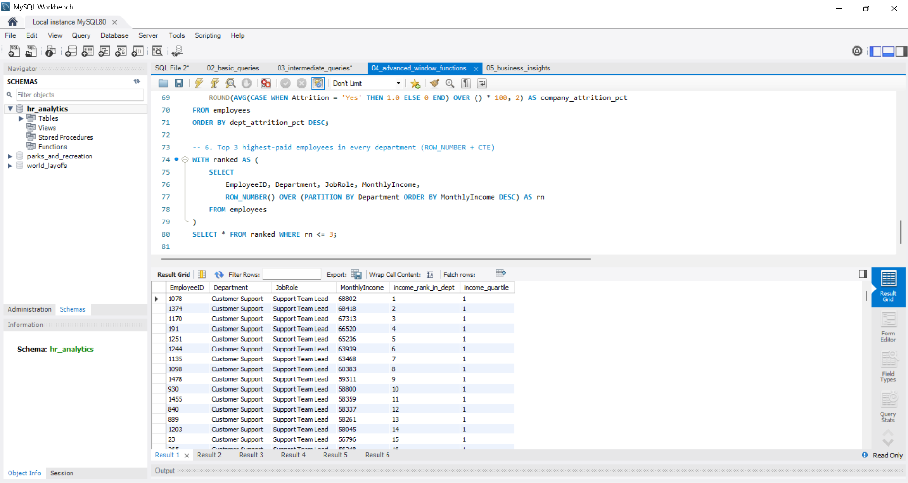
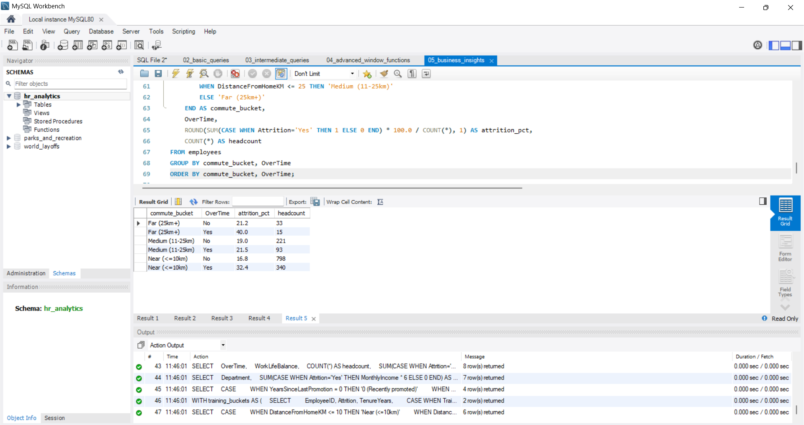
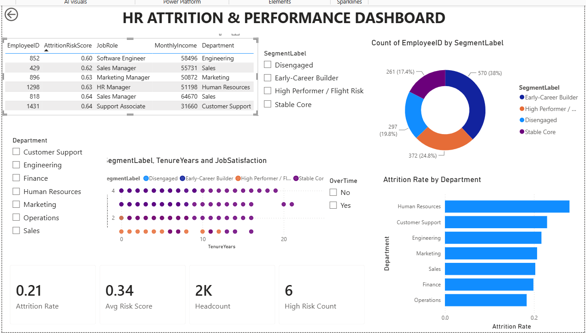
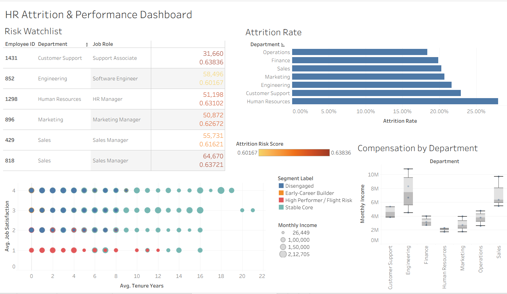

# HR Attrition & Performance Analytics — End-to-End Pipeline

A complete data analytics pipeline that takes raw HR data through **Excel → SQL → Python (ML) → Power BI & Tableau**, predicting which employees are likely to leave and explaining why — the kind of question real HR/People Analytics teams pay for.

Every stage of this pipeline was built, run, and debugged end-to-end on my own machine — not just handed to me finished. See the "Build Notes" section at the bottom for the real issues I hit and fixed along the way.

## Why this project is different

Most portfolio projects stop at "I made a dashboard." This one is an actual **pipeline**: the same dataset flows through five tools, each doing the job it's best at, and each stage's output feeds the next.

```
Raw data (synthetic, 1,500 employees, 4 linked tables)
        │
        ▼
   EXCEL  →  data cleaning, pivot-style summary sheet, first-pass charts
        │
        ▼
   SQL (MySQL)  →  relational schema, 20+ queries (joins, CTEs, window functions)
        │
        ▼
   PYTHON (pandas, numpy, scikit-learn)  →  EDA, attrition prediction model,
        │                                    employee segmentation (KMeans)
        ▼
   POWER BI  +  TABLEAU  →  two independent interactive dashboards from the
                             same model output (shows tool flexibility)
```

## Dataset

Synthetic but realistic — generated with correlated variables (not random noise), so the patterns a recruiter or interviewer digs into are actually real and explainable, similar in spirit to the well-known IBM HR Analytics dataset but built from scratch.

| Table | Rows | Grain |
|---|---|---|
| `employees.csv` | 1,500 | 1 row per employee |
| `performance_reviews.csv` | 3,890 | 1 row per employee per review year |
| `attendance.csv` | 16,870 | 1 row per employee per month (2025) |
| `salary_history.csv` | 4,179 | 1 row per salary change event |

Overall attrition rate: **21.3%** — realistic for a mid-size company, with meaningful variation by department, overtime, work-life balance, and promotion history.

## 1. Excel — `excel/HR_Attrition_Analysis.xlsx`

- **Raw Data** sheet: the full employee table.
- **Summary** sheet: department-level KPIs built entirely with `COUNTIF`/`COUNTIFS`/`SUMIFS` formulas that reference Raw Data — nothing hardcoded, so it recalculates if you edit the data.
- **Dashboard** sheet: bar chart (attrition rate by department), pie chart (headcount split), bar chart (average income by department), all linked to the Summary sheet.

*Skills demonstrated: pivot-style aggregation with lookup formulas, formula auditing, chart building, dashboard layout.*

## 2. SQL — `sql/`

Five files, progressive difficulty (this is the order to walk an interviewer through). Database built and every query run in MySQL Workbench.

1. `01_schema.sql` — relational schema, 4 tables, foreign keys.
2. `02_basic_queries.sql` — filtering, `GROUP BY`/`HAVING`, aggregation.
3. `03_intermediate_queries.sql` — joins, correlated subqueries, derived tables.
4. `04_advanced_window_functions.sql` — `RANK()`, `ROW_NUMBER()`, `NTILE()`, `LAG()`, CTEs.
5. `05_business_insights.sql` — the "so what" queries: estimated cost of attrition per department, does training reduce attrition, promotion-stagnation vs exits.

**Window functions in action** — top 3 highest-paid employees in every department, using `ROW_NUMBER()` inside a CTE:



**Business insight query** — attrition rate by commute distance, split by overtime. Far-commute employees who also work overtime hit **40% attrition**, more than double the near-commute/no-overtime baseline of 16.8% — the two factors compound rather than just add:



## 3. Python — `python/`

1. `01_generate_data.py` — the synthetic data generator (documents exactly how the data was built — good to be transparent about this in interviews).
2. `02_eda_and_ml.py`:
   - **EDA**: attrition rate by department, saved as a chart.
   - **Attrition Prediction**: `RandomForestClassifier` (scikit-learn), balanced class weights, **ROC-AUC = 0.690**, with a feature-importance chart showing `MonthlyIncome`, `TenureYears`, and `Age` as the top drivers. Scores every *current* employee with a risk probability → `data/at_risk_employees.csv` (6 employees flagged high-risk).
   - **Employee Segmentation**: `KMeans` (k=4) on tenure/satisfaction/performance/income → four personas: *Early-Career Builder* (570), *High Performer / Flight Risk* (372), *Disengaged* (297), *Stable Core* (261) → `data/employee_segments.csv`.
3. `03_build_excel.py` — generates the Excel workbook above with `openpyxl`.

Outputs (charts + metrics) are saved to `docs/`.

*Skills demonstrated: pandas data wrangling, feature engineering, supervised classification, unsupervised clustering, model evaluation (ROC-AUC, confusion matrix, classification report), matplotlib visualization.*

## 4. Power BI Dashboard



Built from `data/employees_powerbi_tableau.csv`. DAX measures for Attrition Rate, Avg Risk Score, Headcount, and High Risk Count; a Risk Watchlist table filtered to `RiskCategory = High`; a Segment donut chart; a Tenure-vs-Satisfaction scatter; a department attrition bar chart; and Department/OverTime/Segment slicers tying it all together.

```dax
Attrition Rate = DIVIDE(CALCULATE(COUNTROWS(employees_powerbi_tableau), employees_powerbi_tableau[Attrition]="Yes"), COUNTROWS(employees_powerbi_tableau))
Avg Risk Score = AVERAGE(employees_powerbi_tableau[AttritionRiskScore])
High Risk Count = CALCULATE(COUNTROWS(employees_powerbi_tableau), employees_powerbi_tableau[RiskCategory]="High")
Headcount = COUNTROWS(employees_powerbi_tableau)
```

## 5. Tableau Dashboard



**🔗 [Live interactive version on Tableau Public](https://public.tableau.com/app/profile/riteek.gore/viz/Book1_17870377056970/HRAttritionPerformanceDashboard)**

Same dataset, four linked sheets: Attrition Rate by department, Risk Watchlist (the 6 flagged employees), Employee Segments scatter, and Compensation by Department (box plots). Building both BI tools on the same modeled data — rather than picking one — was a deliberate choice, since job postings often ask for "Power BI or Tableau" and this removes any doubt about which one I can use.

## Key business findings

- Overtime + long commute together push attrition to 40% — more than double either factor alone (16.8% baseline).
- Employees who go 4+ years without a promotion leave at a meaningfully higher rate than recently-promoted employees.
- HR (28.0%) and Customer Support (22.9%) have the highest departmental attrition; Operations (18.3%) the lowest.
- Estimated replacement cost (6 months' salary per exit, a standard HR rule of thumb) is highest in Engineering and Sales due to headcount size, even though their attrition *rate* isn't the worst.

## Repo structure

```
hr_project/
├── data/                          # all CSVs (raw + model outputs)
├── sql/                           # schema + 4 levels of queries
├── python/                        # data generation, EDA/ML, Excel builder
├── excel/HR_Attrition_Analysis.xlsx
├── docs/                          # charts, model metrics, dashboard screenshots
└── README.md
```

## Tech stack
`Excel` · `MySQL` · `Python (pandas, numpy, scikit-learn, matplotlib)` · `Power BI` · `Tableau`

---

## Build notes (the honest version)

This project wasn't a clean one-shot build, and I think that's worth documenting rather than hiding:

- **Model tuning**: my first pass at the attrition-probability formula in the data generator produced a model with ROC-AUC ≈ 0.54 — barely better than random. The issue was a salary calculation that clipped too many values to the same floor, killing a key signal. Fixed the salary formula and recalibrated the logistic intercept, which brought ROC-AUC up to 0.690.
- **SQL import debugging**: MySQL Workbench's Table Data Import Wizard hung indefinitely on the 16,800-row `attendance` table. Switched to a `LOAD DATA LOCAL INFILE` bulk load instead, which needed `local_infile` enabled on both the server (`SET GLOBAL local_infile = 1`) and the client connection (`OPT_LOCAL_INFILE=1` in Workbench's Advanced connection settings) before it would run — finished in under a second once configured correctly.
- **Power BI**: hit a DAX syntax error from pasting multiple measures into one box (each measure needs its own), and a table that displayed department-level sums instead of individual employees until I set each numeric column to "Don't summarize."

## Resume bullets (pick 2–3)

- Built an end-to-end HR attrition analytics pipeline spanning Excel, SQL, Python, and Power BI/Tableau on a 1,500-employee dataset across 4 relational tables.
- Engineered a Random Forest attrition prediction model in scikit-learn (ROC-AUC 0.690), identifying monthly income, tenure, and commute distance as top attrition drivers, and scored the full active workforce for HR-ready risk flags.
- Applied K-Means clustering to segment 1,500 employees into 4 actionable personas (e.g., "High Performer / Flight Risk") to support targeted retention strategy.
- Wrote 20+ SQL queries across 4 difficulty tiers (joins, correlated subqueries, window functions, CTEs) to answer departmental attrition, cost-of-turnover, and promotion-stagnation questions.
- Designed and published dual interactive dashboards in Power BI and Tableau from the same modeled dataset, with DAX/calculated-field KPIs for attrition rate, risk score, and segment distribution.